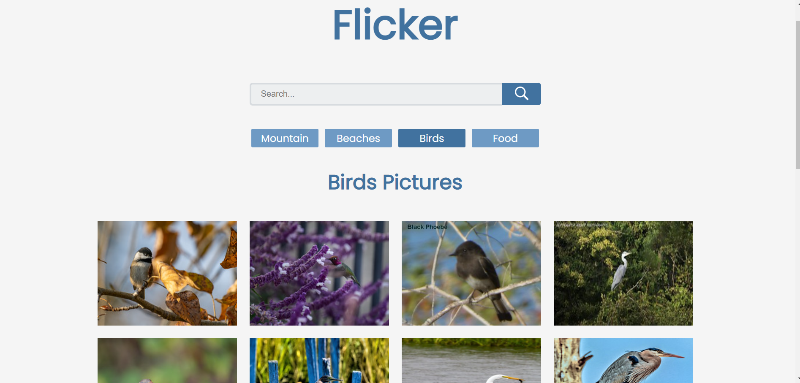
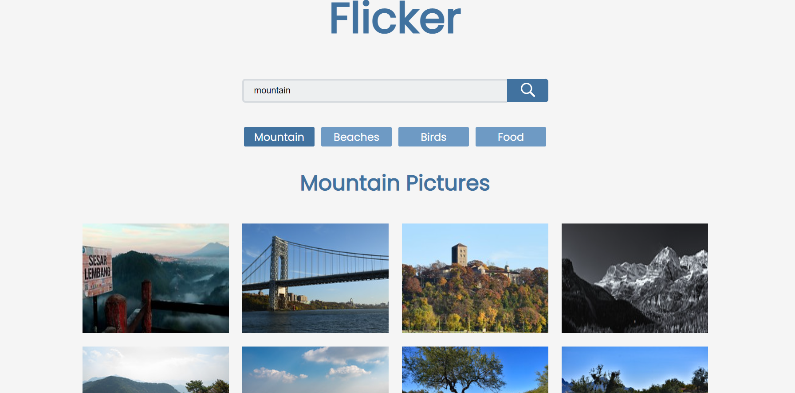

# **FLICKER** #

It's a gallery based project which shows different images by clicking on links. Search bar displays images of a particular search input. We used React Router to make links.

## Images ##

By clicking on particular links,images will shown in the UI.

## Trainer Target
- React Hooks
- React Router
- Api
- Responsive
- CSS
- Axios

## Trainee Achieved
- having knowledge of React Hooks
- Learned on working in React Router
- knowledge of using API
- knowledge of using axios and making the UI responsive

## Tech stack
### _Language_ : HTML, CSS, Javascript, React